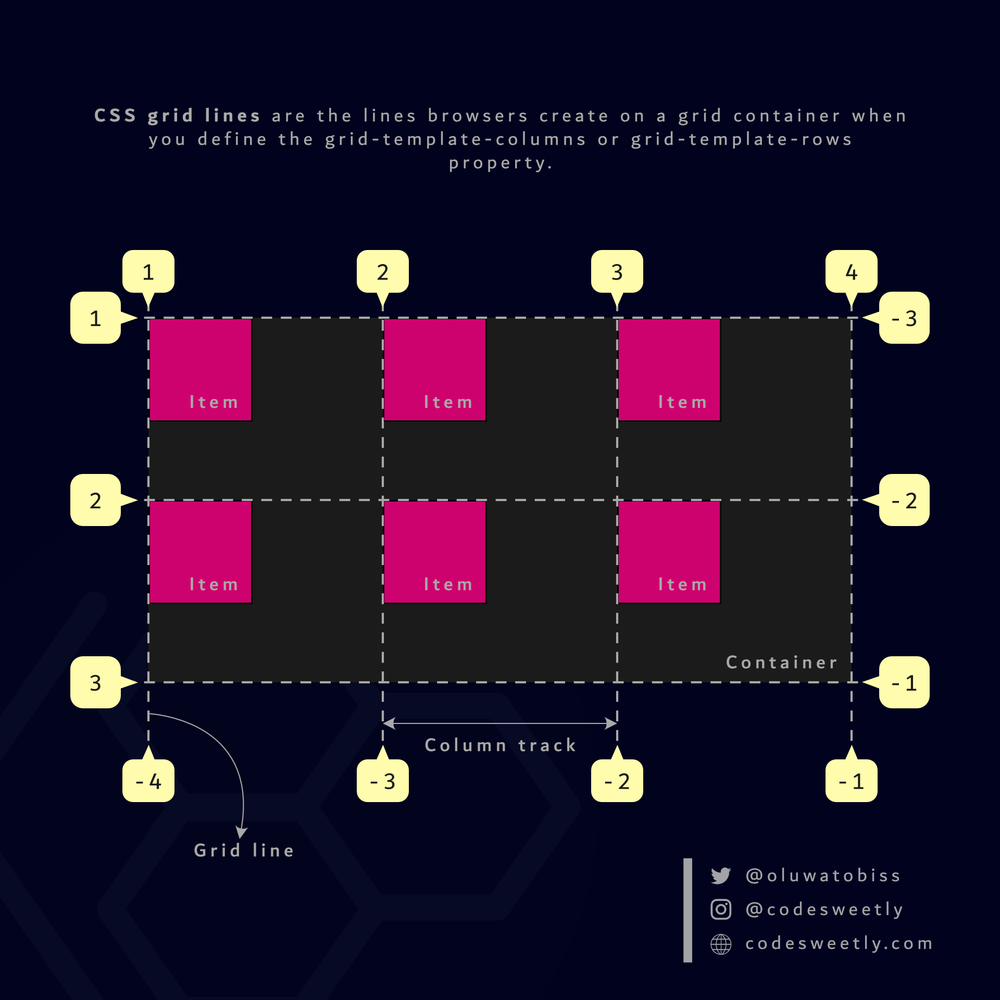

# Grid

El grid es basa en definir un quadrícula.

Igual que amb flex, el contenidor ha de tenir `display:grid`. Les propietats `grid-template-rows` i `grid-template-columns` defineixen quantes files i columnes hi haurà.

```css
.contenidor-grid {
    display: grid;
    grid-template-rows: 1fr 2fr;
    grid-template-columns: 1fr 2fr 4fr;
}
```

Les files i columnes es poden definir amb unitats de mesura com pixels o percentatges, o el valors `fr` que indiquen l'espai relatiu que ocupen.

Amb la propietat `grid-template-areas` es poden definir noms a les areas que ocupen 1 o més cel·les colindants:

```css
.contenidor-grid {
    display: grid;
    grid-template-rows: 1fr 4fr 1fr;
    grid-template-columns: 1fr 3fr;
    grid-template-areas:    "head head"
                            "nav  main"
                            "nav  foot";
}
```

I per indicar a quina àrea van els elements s'ha de posar la propietat `grid-area` amb el nom de l'àrea.

Enlloc de posar-hi noms, també es poden ubicar els elements amb les propietats:

```css
.element-head {
    grid-row-start: 1;
    grid-row-end: 2;
    grid-column-start: 1;
    grid-column-end: 3;
}
```

En aquesta imatge es pot veure com es compten les línies:


 
Finalment també és important la propietat `gap` per a definir espai entre les files i les columnes.

En aquesta enllaç trobaràs mes propietats de grid: https://css-tricks.com/snippets/css/complete-guide-grid/


