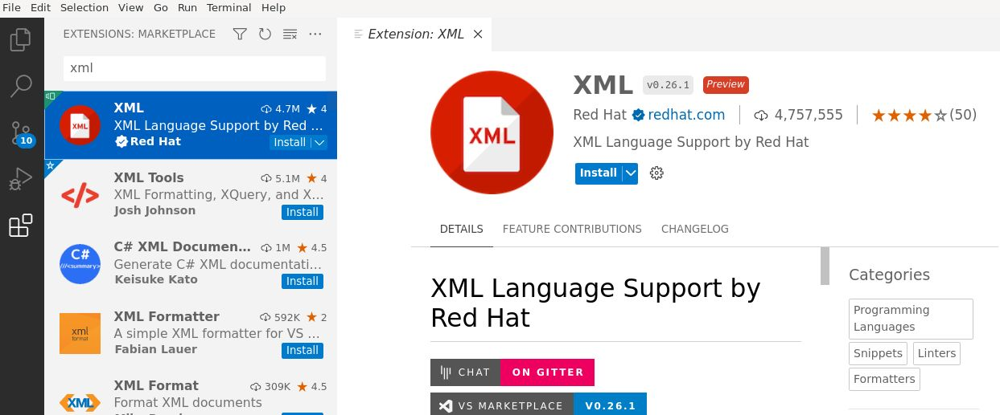
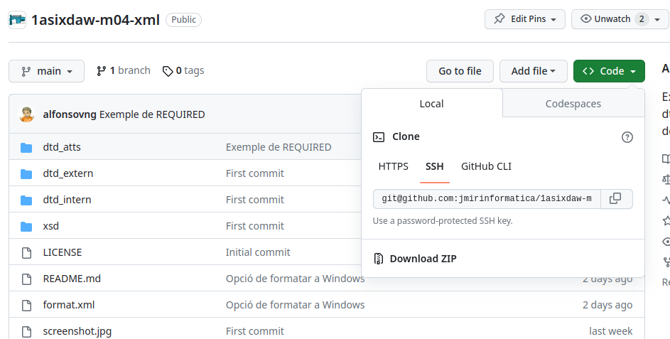

# Extensió XML de Visual Studio Code

L'[extensió XML de RedHat per a Visual Studio Code](https://marketplace.visualstudio.com/items?itemName=redhat.vscode-xml) proporciona suport per crear i editar fitxers XML, així com a validar-los amb DTD i XSD.

Instal·la l'extensió al Visual Studio Code:

## Com "descarregar" aquest codi?

Farem servir [git](https://es.wikipedia.org/wiki/Git). En un terminal, executa la comanda:

    git clone https://github.com/jmirinformatica/1asixdaw-m04-xml.git

Et crearà una carpeta anomenada `1asixdaw-m04-xml`. Obre-la amb Visual Studio Code:

    code 1asixdaw-m04-xml

També pots trobar en [aquesta mateixa pàgina del repositori a github](https://github.com/jmirinformatica/1asixdaw-m04-xml) com [descarregar tot el projecte en format ZIP](https://github.com/jmirinformatica/1asixdaw-m04-xml/archive/refs/heads/main.zip):

## Formatar XML

Per formatar l'XML fes botó dret sobre l'XML i triar l'opció "Format Document" o les tecles ràpides `CTRL + SHIFT + I` a Linux o `ALT + SHIFT + F` a Windows. Pots practicar-ho amb el xml [format.xml](./format.xml).

## DTD

Consulta els exemples de com validar un XML contra un [dtd extern](./dtd_extern/) o amb un [dtd intern](./dtd_intern/). També pots revisar l'exemple de [com es validen els atributs amb DTD](./dtd_atts/).

## XSD

Consulta l'[exemple de XSD](./xsd/).
